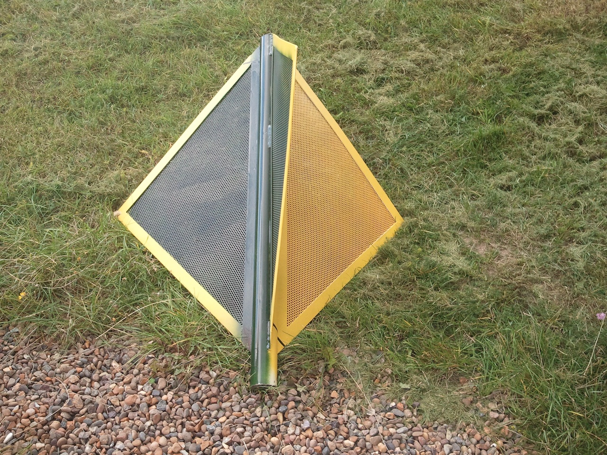
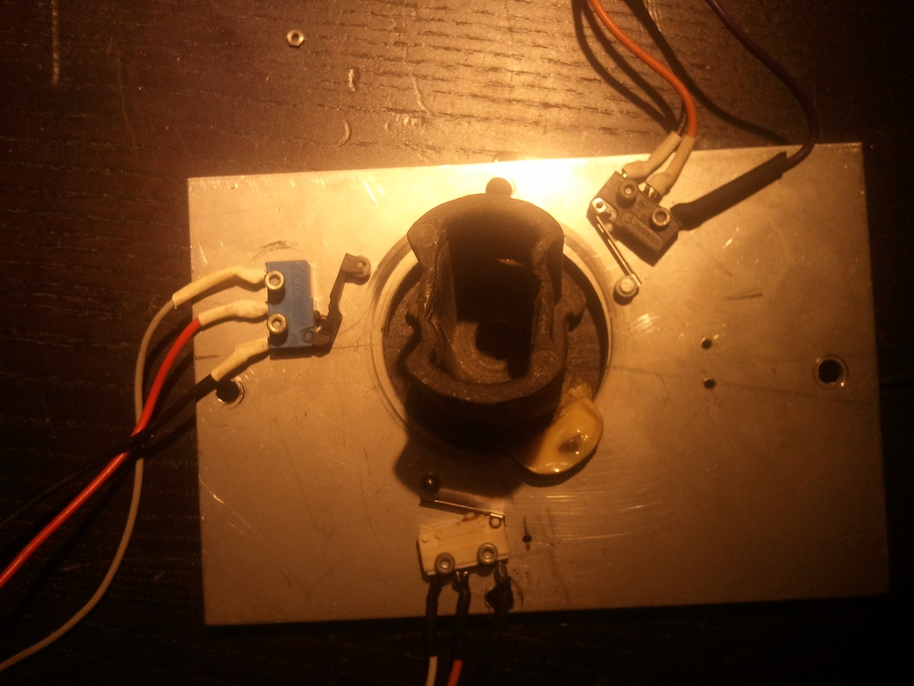
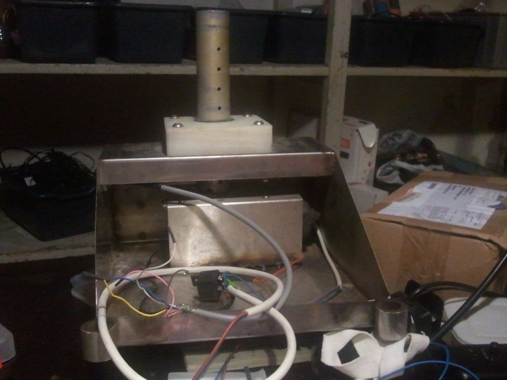

kite_flag_arduino
=================

## Pin connections

- Analog 0
 
- **Analog 0:** Button (select, up, right, down and left)
- **Analog 1**: output RED_LED
- **Analog 2**: output GREEN_LED
- **Analog 3**: output YELLOW_LED
- **Analog 4**: TWI Voltmeter 
- **Analog 5**: TWI
- **Digital 0**: RX
- **Digital 1**: TX
- **Digital 2**: input RED
- **Digital 3**: input GREEN
- **Digital 4**: DB4 
- **Digital 5**: PWM DB5
- **Digital 6**: PWM DB6
- **Digital 7**: DB7
- **Digital 8**: RS (Data or Signal Display Selection)
- **Digital 9**: PWM Enable
- **Digital 10**: PWM,SPI Backlit Control
- **Digital 11**: Output Horn
- **Digital 12**: input YELLOW
- **Digital 13**: output FLAG_MOTOR

## Hardware Setup

